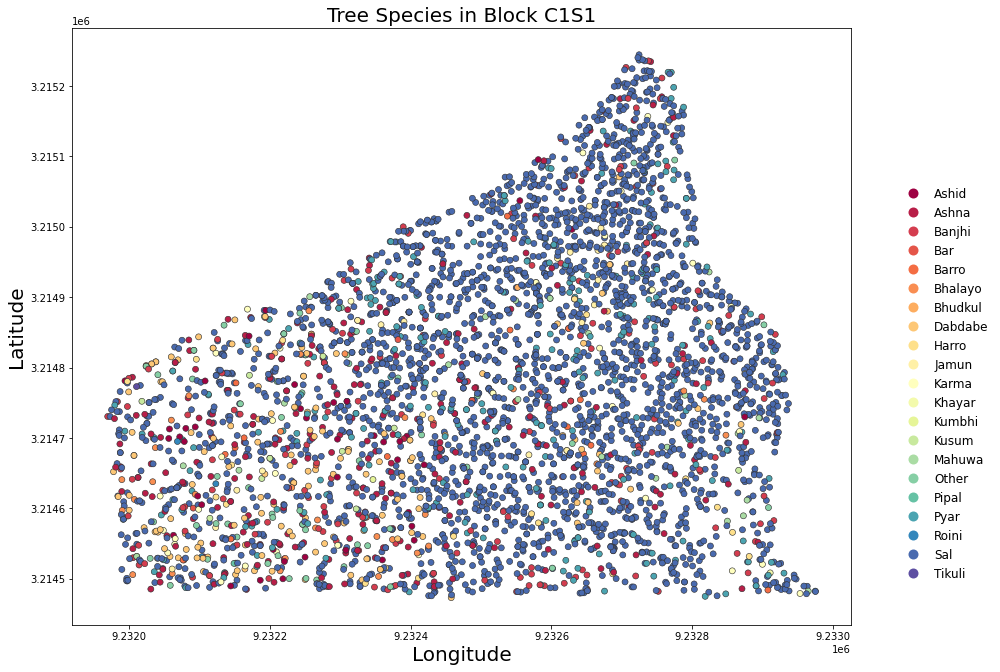
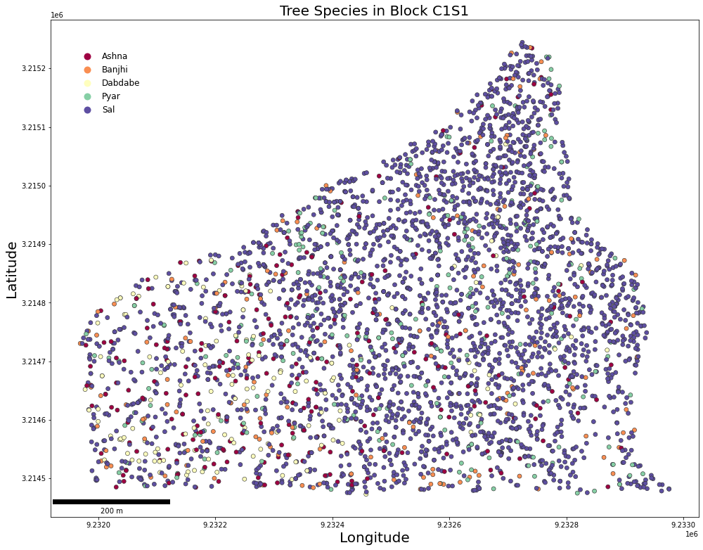

# Geospatial Data in Python: Software Preparation, Data Reading, and Displaying
###  Mukti Subedi: suvedimukti@gmail.com


In this tutorial. I will layout necessary process to downoad the latest verion of `python`, package distribution system `anaconda`, install some extra packages and read 
`shapefile` data.

 First let's begin by installing Python, I hope you already know how to install it. 
    
## Install Python
To install python visit <a href="https://www.python.org/downloads/" target= "_blank">Python Website</a> and click on download. In this tutorial I am using Microsoft's Windows 10 Operating system. Therefore,This tutorial specifically focuses on Windows. Once you find the version of python you wish to install, simply click on it and wait until the download gets completed. When the download complets simply run the execution file and follow along with the subsequent pop-up windows. 
   
When installation gets completed, you can check version of your python installed on your machine by opening `command prompt` (ctrl+Run, and type cmd). On the command prompt type
   
   `py --version`
    
This will give you the inforamtion on current version of python installed on your machine. 
    
    
## Install Anaconda

To manages python packages I usually use `*conda*` distirbution than `*pip*`. When conda fails then I turned to pip. You can find more information on `conda` and
    `pip` <a href = "https://stackoverflow.com/questions/20994716/what-is-the-difference-between-pip-and-conda" target = "_blank"> in this Stack Overflow discussion</a>
    
 To download the `Anaconda` distribution, visit <a href = "www.anaconda.com" target = "_blank"> Anaconda website</a>. Hover over **Products** tab and select **Individual Edition**. Hit the download button to begin the download process. Once the download gets completed install the software accepting all defaults. After anaconda installation, go to start icon of your machine, and find `Anaconda prompt` if required open it as an administrator.
 
 First, lets update `conda` on your anaconda prompt type following:
 
 1) `conda update conda`
 2) `conda update --all`
 3) `conda list`          # this lists the packages installed, check pandas and matplotlib
 
 To use the `geospatial` data we need **geopandas**, and **shapely** packages. Lets install `geopandas` which should also install `shapely` packages as a dependency.
 
 conda install geopandas or conda install -c conda-forge geopandas
 
 Basically, to install any packages you can type **conda install** `<Package name>`
 
You can find more infomation on <a href = "https://geopandas.org/en/stable/getting_started.html" target = "_blank"> **geopandas** </a>, and <a href = "https://shapely.readthedocs.io/en/stable/manual.html" target = "_blank"> **Shapely** </a>


## Load Library


```python
import shapely             # load shapely package
import matplotlib as plt   # load matplotlib as plt
import geopandas as gpd    # load geopandas as gpd
import os                  # operating system
from IPython.display import Markdown as md
```

## Read Geospatial Data

Geopandas library contains geospatial dataset e.g., `naturalearth_lowers`, which contains  the geometry of each country in the world along with other attribute information. Usually, we have our own data and want to read it directly from our directory. Lets read the data from direcotry of my machine, you can change the path of your data depending on path of your data

If you have a file containing both data and geometry (e.g. GeoPackage, Shapefile), you can read it using `geopandas.read_file()`, which automatically detects the filetype and creates a `GeoDataFrame`. I have my `point shapefile` on my computer's directory. Lets read it first. 


```python
pdata = gpd.read_file("./Data/c1s1.shp") #./ starts looking at file from current working directory
```


```python
os.getcwd()
```


    'G:\\IntroSpatialData'


c1s1.shp data is threfore located in the **Data** folder which is nested within the **IntroSpatialData** folder


```python
# Print pdata 
pdata.head(6)
```


<div>
<style scoped>
    .dataframe tbody tr th:only-of-type {
        vertical-align: middle;
    }

    .dataframe tbody tr th {
        vertical-align: top;
    }

    .dataframe thead th {
        text-align: right;
    }
</style>
<table border="1" class="dataframe">
  <thead>
    <tr style="text-align: right;">
      <th></th>
      <th>sn</th>
      <th>Tree_numbe</th>
      <th>lat</th>
      <th>lon</th>
      <th>treeid</th>
      <th>species</th>
      <th>dbh</th>
      <th>height</th>
      <th>class</th>
      <th>remarks</th>
      <th>Compartmen</th>
      <th>geometry</th>
    </tr>
  </thead>
  <tbody>
    <tr>
      <th>0</th>
      <td>1.0</td>
      <td>142.0</td>
      <td>3068940.39</td>
      <td>691125.84</td>
      <td>1.0</td>
      <td>Pyar</td>
      <td>30.0</td>
      <td>15.0</td>
      <td>2.0</td>
      <td>None</td>
      <td>C1S1</td>
      <td>POINT (691125.840 3068940.390)</td>
    </tr>
    <tr>
      <th>1</th>
      <td>2.0</td>
      <td>145.0</td>
      <td>3068946.55</td>
      <td>691109.18</td>
      <td>2.0</td>
      <td>Sal</td>
      <td>39.0</td>
      <td>16.0</td>
      <td>2.0</td>
      <td>None</td>
      <td>C1S1</td>
      <td>POINT (691109.180 3068946.550)</td>
    </tr>
    <tr>
      <th>2</th>
      <td>3.0</td>
      <td>141.0</td>
      <td>3068938.55</td>
      <td>691129.03</td>
      <td>3.0</td>
      <td>Sal</td>
      <td>48.0</td>
      <td>16.0</td>
      <td>2.0</td>
      <td>None</td>
      <td>C1S1</td>
      <td>POINT (691129.030 3068938.550)</td>
    </tr>
    <tr>
      <th>3</th>
      <td>4.0</td>
      <td>144.0</td>
      <td>3068945.74</td>
      <td>691114.22</td>
      <td>4.0</td>
      <td>Sal</td>
      <td>38.0</td>
      <td>15.0</td>
      <td>2.0</td>
      <td>None</td>
      <td>C1S1</td>
      <td>POINT (691114.220 3068945.740)</td>
    </tr>
    <tr>
      <th>4</th>
      <td>5.0</td>
      <td>143.0</td>
      <td>3068943.58</td>
      <td>691117.80</td>
      <td>5.0</td>
      <td>Sal</td>
      <td>34.0</td>
      <td>18.0</td>
      <td>1.0</td>
      <td>None</td>
      <td>C1S1</td>
      <td>POINT (691117.800 3068943.580)</td>
    </tr>
    <tr>
      <th>5</th>
      <td>6.0</td>
      <td>146.0</td>
      <td>3068950.75</td>
      <td>691108.22</td>
      <td>6.0</td>
      <td>Sal</td>
      <td>38.0</td>
      <td>18.0</td>
      <td>1.0</td>
      <td>None</td>
      <td>C1S1</td>
      <td>POINT (691108.220 3068950.750)</td>
    </tr>
  </tbody>
</table>
</div>


Now, the returned information seems familiar, right? **Geopandas** essentially is an extentiono of **pandas** packages to handle geospatial data. For each observation there is an geometry information associated with it along with other fields and records. One of the important information associated with geospatial data is "Coordinate Reference System" or `CRS`. Lets look find out


```python
# print coordinate system of point data
pdata.crs
```


    <Projected CRS: EPSG:32644>
    Name: WGS 84 / UTM zone 44N
    Axis Info [cartesian]:
    - E[east]: Easting (metre)
    - N[north]: Northing (metre)
    Area of Use:
    - name: World - N hemisphere - 78°E to 84°E - by country
    - bounds: (78.0, 0.0, 84.0, 84.0)
    Coordinate Operation:
    - name: UTM zone 44N
    - method: Transverse Mercator
    Datum: World Geodetic System 1984
    - Ellipsoid: WGS 84
    - Prime Meridian: Greenwich


```python

```


```python

```

Now, it is evident that the `pdata` is projected data with EPSG (European Petroleum Survey Group):32644 or Universal Transverse Mercator (UTM) zone 44N. `data.crs` function results three information about the data a) Name of projection system, b) area of projection system used /area of data's location, and 3) Datum of the tranformation.

What if this is not the correct projection sytem of the data. How do we change it? this is simple, we can invoke `data.to_crs` function to change projection information. 

What if there was no coordinate system associated with the geographic data? you can try `data.set_crs` function to set your data. If you are familiar with ESRI's ArcGIS Desktop or ArcGIS Pro; `.set_crs`, and `.to_crs` are equivalent to `define projection`, and `project` function, respectively. 


For the sake of practice lets change the coordinate system of data to UTM web mercator projection i.e., **(EPSG:3857)**


```python
pwmdata = pdata.to_crs("EPSG:3857")
```

print coordinate system of re-projected data **pwmdata**.


```python
pwmdata.crs   # check what has changed
```


    <Projected CRS: EPSG:3857>
    Name: WGS 84 / Pseudo-Mercator
    Axis Info [cartesian]:
    - X[east]: Easting (metre)
    - Y[north]: Northing (metre)
    Area of Use:
    - name: World - 85°S to 85°N
    - bounds: (-180.0, -85.06, 180.0, 85.06)
    Coordinate Operation:
    - name: Popular Visualisation Pseudo-Mercator
    - method: Popular Visualisation Pseudo Mercator
    Datum: World Geodetic System 1984
    - Ellipsoid: WGS 84
    - Prime Meridian: Greenwich


## Make Map

GeoPandas can also plot maps. To plot the active geometry, call `GeoDataFrame.plot()`. To color code by another field, pass in that column as the first argument. In the present dataset (point) I will plot the active geometry column and color code by the "species" column.


```python
#pwmdata.species.head()

#pwmdata.species = pwmdata.species.astype('category')

pwmdata.loc[:, 'species'] = pwmdata['species'].astype('category')
```


```python
from matplotlib import pyplot as plt

# species ("Ashid","Ashna","Banjhi","Bar","Barro","Bhayalo","Bhudkul","Dabdabe","Harro","Jamun","Karma","Khayar","Khumbhi","Kusum","Mahuwa","Other","Pipal","Pyar","Roini","Sal","Tikauli")


fig, ax = plt.subplots(1, figsize=(14,14)) # figure size

pwmdata.plot(column='species', categorical=True, 
             cmap='Spectral', linewidth=.6, edgecolor='0.2',
             legend=True, 
             legend_kwds={'bbox_to_anchor':(1.05, 0.75),'fontsize':12,'frameon':False}, ax=ax)
ax.set_xlabel("Longitude", fontsize = 20)
#ax.set_xmargin(0.01)
ax.set_ylabel("Latitude", fontsize = 20)
ax.set_title('Tree Species in Block C1S1',fontsize=20)
#ax.add_artist(scale1)
plt.tight_layout()
#plt.savefig('images/rhodesia_land_classes.png',dpi=300)

```


    

    

# make map changing size
map= pwmdata.plot("species",figsize = (12,12), legend = True)
map.legend(loc='upper left')
#map.tight_layout()
#map.show()
map.plot()

```python
#Install scale bar module
#conda install -c conda-forge matplotlib-scalebar
# layout
from matplotlib_scalebar.scalebar import ScaleBar
scale1 = ScaleBar(
dx=1, label='',
    location='lower left',  # in relation to the whole plot
    label_loc='left', scale_loc='bottom'  # in relation to the line
)
```


```python
# Which specie has th most count in the file

pwmdata.groupby(['species']).size().reset_index(name='counts').sort_values('counts')

# counts by species
counts = pwmdata['species'].value_counts()


counts[counts>100]

fildata = pwmdata[pwmdata['species'].isin(counts[counts > 99].index)]
```

# Manipulate Data


```python
# counts by species
counts = pwmdata['species'].value_counts()
```


```python
counts
```


    Sal        2951
    Ashna       267
    Pyar        263
    Banjhi      180
    Dabdabe     142
    Other        55
    Ashid        44
    Bhalayo      40
    Karma        36
    Mahuwa       25
    Jamun        24
    Harro        22
    Barro        18
    Kusum        11
    Bar           5
    Roini         3
    Khayar        1
    Kumbhi        1
    Bhudkul       1
    Pipal         1
    Tikuli        1
    Name: species, dtype: int64


```python
#fildata.info()
counts
counts[counts>99]
```


    Sal        2951
    Ashna       267
    Pyar        263
    Banjhi      180
    Dabdabe     142
    Name: species, dtype: int64


## Subset by species count

One approach would be to count values `value_counts` to create an aggregate series, which we used before is: `counts` We can now use this information to filter the dataset


```python
# Filter by aggregate series
fildata = pwmdata[pwmdata['species'].isin(counts[counts > 99.0].index)]
fildata.info
```


    <bound method DataFrame.info of           sn  Tree_numbe         lat        lon  treeid  species   dbh  \
    0        1.0       142.0  3068940.39  691125.84     1.0     Pyar  30.0   
    1        2.0       145.0  3068946.55  691109.18     2.0      Sal  39.0   
    2        3.0       141.0  3068938.55  691129.03     3.0      Sal  48.0   
    3        4.0       144.0  3068945.74  691114.22     4.0      Sal  38.0   
    4        5.0       143.0  3068943.58  691117.80     5.0      Sal  34.0   
    ...      ...         ...         ...        ...     ...      ...   ...   
    4086  5577.0       626.0  3068503.35  690624.41  5806.0      Sal  30.0   
    4087  5578.0       198.0  3068678.81  690872.16  5807.0      Sal  42.0   
    4088  5579.0       285.0  3068744.32  690837.30  5808.0     Pyar  32.0   
    4089  5580.0       360.0  3068696.09  690631.54  5809.0  Dabdabe  51.0   
    4090  5581.0       372.0  3068660.31  690604.69  5810.0  Dabdabe  37.0   
    
          height  class remarks Compartmen                         geometry  
    0       15.0    2.0    None       C1S1  POINT (9232712.329 3215136.148)  
    1       16.0    2.0    None       C1S1  POINT (9232693.633 3215143.436)  
    2       16.0    2.0    None       C1S1  POINT (9232715.897 3215134.004)  
    3       15.0    2.0    None       C1S1  POINT (9232699.308 3215142.427)  
    4       18.0    1.0    None       C1S1  POINT (9232703.310 3215139.912)  
    ...      ...    ...     ...        ...                              ...  
    4086    12.0    1.0    None       C1S1  POINT (9232138.589 3214649.193)  
    4087    10.0    2.0    None       C1S1  POINT (9232421.343 3214843.865)  
    4088    10.0    3.0    None       C1S1  POINT (9232383.158 3214918.821)  
    4089    12.0    1.0    None       C1S1  POINT (9232150.055 3214867.765)  
    4090    12.0    1.0       M       C1S1  POINT (9232119.114 3214827.644)  
    
    [3803 rows x 12 columns]>


```python
#The data has `fildata.shape[0]`
#from IPython.display import Markdown as md
md(f"The filtered data, i.e. `fildata`,  consists of {fildata.shape[0]} records")
```


The filtered data, i.e. `fildata`,  consists of 3803 records


 filter by groupby
 I prefer to use `groupby` appraoch as this is similar to `R:dplyr`


```python
fildatag = pwmdata.groupby('species').filter(lambda x: len(x) >= 99)

```


```python
md(f"The filtered data using `groupby` function shows that the data has same number of records as given by aggretaing series approach:  {fildatag.shape[0]} records")
```


The filtered data using `groupby` function shows that the data has same number of records as given by aggretaing series approach:  3803 records


```python
import geoplot as gplt
from matplotlib import pyplot as pplot

#pwmdata.species.head()

fildatag.loc[:, 'species'] = pwmdata['species'].astype('string')
```


```python
# plot figure 
fig, ax = plt.subplots(1, figsize=(14,14))                              # figure size

fildatag.plot(column='species', categorical=True, 
             cmap='Spectral', linewidth=.6, edgecolor='0.2',
             legend=True, 
             legend_kwds={'bbox_to_anchor':(0.15, 0.95),'fontsize':12,'frameon':False}, ax=ax)
ax.set_xlabel("Longitude", fontsize = 20)
#ax.set_xmargin(0.01)
ax.set_ylabel("Latitude", fontsize = 20)
ax.set_title('Tree Species in Block C1S1',fontsize=20)
ax.add_artist(scale1)
plt.tight_layout()

```


    

    


#-------------------------------- The End --------------------------------------------------------------------------------


```python

```


```python

```


```python

```


```python

```
